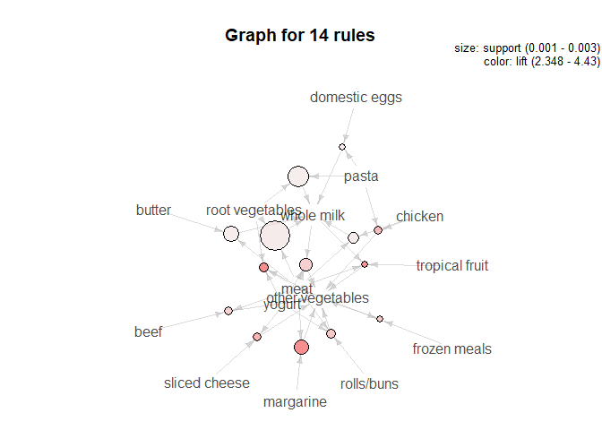
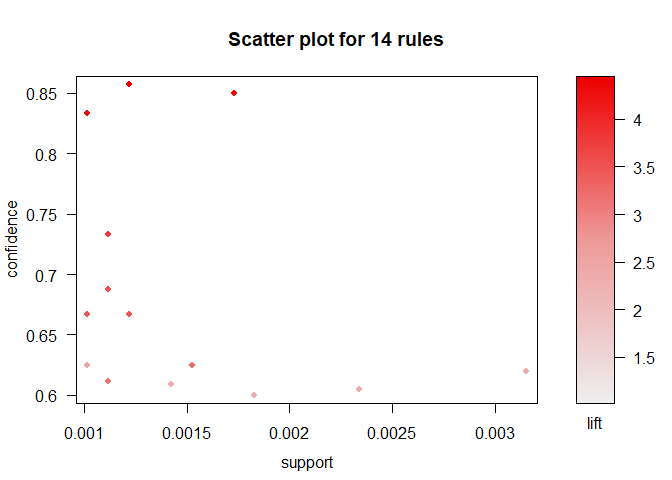
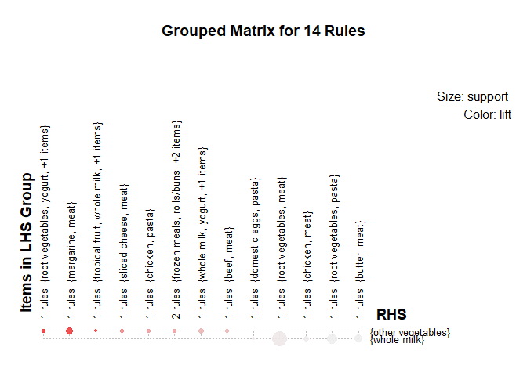
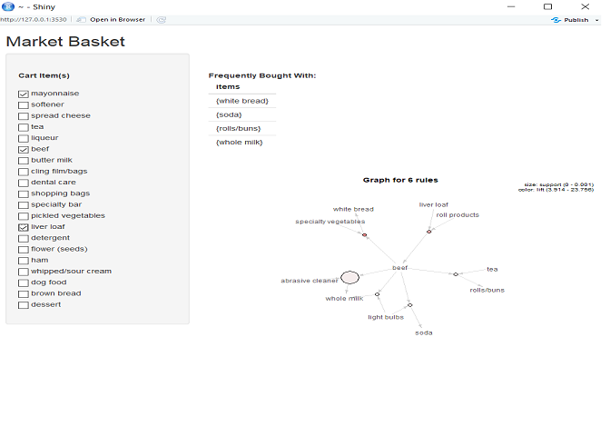

association rules with R
================
 
Market Basket Analysis with R
-----------------------------
 
``` r
suppressMessages(library(arules))
data("Groceries")
summary(Groceries)
```
 
    ## transactions as itemMatrix in sparse format with
    ##  9835 rows (elements/itemsets/transactions) and  
    ##  169 columns (items) and a density of 0.02609146
    ##
    ## most frequent items:
    ##       whole milk other vegetables       rolls/buns             soda
    ##             2513             1903             1809             1715
    ##           yogurt          (Other)
    ##             1372            34055
    ##
    ## element (itemset/transaction) length distribution:
    ## sizes
    ##    1    2    3    4    5    6    7    8    9   10   11   12   13   14   15
    ## ‪2159 1643 1299 1005‬  855  645  545  438  350  246  182  117   78   77   55
    ##   16   17   18   19   20   21   22   23   24   26   27   28   29   32
    ##   46   29   14   14    9   11    4    6    1    1    1    1    3    1
    ##
    ##    Min. 1st Qu.  Median    Mean 3rd Qu.    Max.
    ##   1.000   2.000   3.000   4.409   6.000  32.000
    ##
    ## includes extended item information - examples:
    ##        labels  level2           level1
    ## 1 frankfurter sausage meat and sausage
    ## 2     sausage sausage meat and sausage
    ## 3  liver loaf sausage meat and sausage
 
``` r
ar <- apriori(Groceries,
              parameter = list(
                support = 0.001,
                confidence = 0.6,
                maxlen = 10
              ),
              control = list(verbose = FALSE))
inspect(sample(ar, 6))
```

    ##     lhs                     rhs                    support confidence     lift count
    ## [1] {chicken,
    ##      pip fruit,
    ##      rolls/buns}         => {other vegetables} 0.001016777  0.6666667 3.445437    10
    ## [2] {tropical fruit,
    ##      butter}             => {whole milk}       0.006202339  0.6224490 2.436047    61
    ## [3] {sausage,
    ##      yogurt,
    ##      frozen vegetables}  => {other vegetables} 0.001423488  0.7000000 3.617709    14
    ## [4] {pip fruit,
    ##      baking powder}      => {whole milk}       0.001626843  0.6400000 2.504735    16
    ## [5] {root vegetables,
    ##      other vegetables,
    ##      frozen vegetables}  => {whole milk}       0.003863752  0.6333333 2.478644    38
    ## [6] {pip fruit,
    ##      root vegetables
    ##      whole milk,
    ##      whipped/sour cream} => {other vegetables} 0.001728521  0.7391304 3.819941    17
 
``` r
subs <- subset(ar,
               subset = lhs %in% c("meat", "pasta"))
subs <- sort(subs, by = "confidence")
subs
```
    ## set of 16 rules
 
``` r
redundant <- which(colSums(is.subset(subs, subs)) > 1)
length(redundant)
```
    ## [1] 2
 
``` r
subs <- subs[-redundant]
              
recs <- unique(rhs(sort(subs, by = "lift")))
inspect(recs)
```
    ##     items         
    ## [1] {other vegetables}
    ## [2] {whole milk}
 
``` r
suppressMessages(library(arulesViz))
plot(subs, method = "graph")
```
 

 
``` r
plot(subs)
```
 

 
``` r
plot(subs, method = "grouped")
```
 

 
``` r
library(shiny)
runApp("App.R")
```
 

